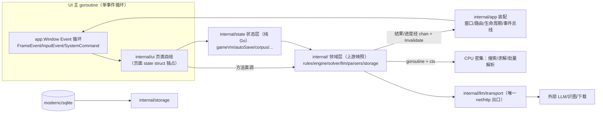

# 00 总体架构与技术选型（Gio 版）

> 与上游 Wails 版（`/home/ssy/proj/chinese_chess_go/design_docs/00-总体架构与技术选型.md`）的关系：
> 上游为"单进程分层（Wails 绑定边界）+ WebView 前端"；本仓为**单进程单二进制（Gio 自绘，无 WebView/无绑定层）**。
> 本文是 Gio 版架构事实源；上游 §5 安全清单中与进程/WebView 无关的条目、上游 §7 不迁移清单继续有效。
> 领域层文档事实源 = 上游同名文档（02~06，见 design_docs/README.md 对照表）。

## 1. 技术选型

### 1.1 选型矩阵

| 决策项 | 采纳 | 弃用候选与理由 | DR |
|---|---|---|---|
| GUI 框架 | gioui.org（立即模式全自绘） | Fyne（保留模式，棋盘自绘/动画同样手写且文本整形弱）、保留 Wails+WebView（违"纯 Go 单二进制"立项目标）、Walk（平台单一） | DR-G003 |
| 文本整形/字体 | go-text/typesetting（Gio 官方栈，中文 shaping） | giofont 内置西文字体（无中文） | DR-G003 |
| 领域层 | 上游映照整体复制（v1.0.0-rc1） | 参照重写 / 复制顺手重构（违映照纪律） | DR-G001 |
| 状态层 | internal/state 纯 Go（上游 stores 为行为锚点） | 保留 TS（违单二进制）、第三方状态库（白名单外无收益） | DR-G002 |
| 并发 | goroutine + context；结果经 channel → Invalidate 排帧 | 独立进程（过度设计） | DR-G003 |
| HTTP | `internal/llm/transport` 收口（复制物不变） | 前端直连（Gio UI 同样禁止） | 上游-DR-004 |
| 数据库 | modernc.org/sqlite（复制物不变） | mattn（CGO） | 上游-DR-002 |
| 设置/凭据 | JSON 文件 / OS keyring + 0600 回退（复制物不变） | — | — |
| 测试 | go test -race + 金标准对拍 + 状态层表驱动 + Gio 层 headless/事件注入 + 手测清单制 | vitest/Playwright（无浏览器面，见 09 差异声明） | 09 |
| 打包 | go build 单二进制 + Linux AppImage/deb/tar.gz + macOS dmg（Windows 形态 M7' 定案） | NSIS（候选，M7' 裁决） | 10 |

### 1.2 上游（Wails）→ Gio 版技术映射

| 上游 | Gio 版 | 说明 |
|---|---|---|
| app.go 绑定层（769 行）| internal/app 装配层 + **方法直调** | 绑定/事件桥消失，见 §3 |
| wailsjs 生成物 / window.go 探测 | 无 | 无 F2 类命名空间坑 |
| EventsEmit 事件 | 领域 goroutine → app 事件通道（chan） | requestId 关联与迟到丢弃语义不变 |
| frontend/src/stores/（10 文件 TS） | internal/state（Go） | DR-G002，行为锚点翻译 |
| frontend/src/{app,features}（React） | internal/ui（Gio 自绘） | 08 文档逐页规格重写 |
| frontend/src/api 适配层（唯一改动面） | **消失**——直调即适配 | 上游 08 §2 的适配面归零 |
| mock 适配器 / npm run dev:web | 无 | 状态层测试 + Gio headless 替代 |
| Playwright E2E | 手测清单制 | 09 §差异声明 |
| wails build / wails.json | go build（ldflags 注入版本） | M7' 打包适配 |
| testdata/golden + cmd/eval | **原样复制物** | 零改动 |

## 2. 单进程分层模型（Gio 版）



| 层 | 职责 | 禁止 |
|---|---|---|
| internal/ui | Gio 自绘页面/组件/动画/绘制 ops | 领域逻辑；import net/http；后台 goroutine 直写 UI 状态 |
| internal/app | 窗口创建、页面路由、生命周期（blur/close）、事件总线（chan 分发 + requestId 过滤）、装配 | 领域逻辑 |
| internal/state | 对局 VM/自动保存恢复/语料浏览/演示播放器/设置（上游 stores 行为锚点） | import Gio/net/http；全局对局单例 |
| internal/ 六包 | 领域（上游映照，纯 Go） | import Gio / frontend / GUI 符号（llm/transport 除外——net/http 仅许该包） |

分层原则一句话：`internal/{rules,engine,solver,llm,parsers,storage,state}` 全部纯 Go（无 Gio/无网络依赖，transport 除外且仅限该包），保证三处复用——`go test` 直跑、internal/app+ui 直调、cmd/eval CLI 直跑；仅 internal/app 与 internal/ui 允许 import gioui.org。

## 3. UI 线程模型（单事件循环，铁律 #G3）

- **主 goroutine**：`app.Main()` + `window.Event()` 阻塞循环。每帧收 `system.FrameEvent` → 构造 gtx → 当前页面 `Layout(gtx)`；输入（点击/键盘/IME）、`system.Command`（close/minimize 等）、`key.FocusEvent`（blur）同循环分发。
- **排帧**：需要新帧（动画进行中、状态变更后）调 `window.Invalidate()`。220ms 飞行动画=每帧按 `time.Now()` 重算插值位置并 Invalidate，**权威结束信号=帧时间戳 ≥ start+220ms**（等价上游"220ms 定时器权威"语义，防错 #1/#2 的 Gio 实现见 08 §防错映射）。
- **后台 goroutine**：CPU 密集与 I/O（搜索/求解/LLM/解析/下载）一律在独立 goroutine（复制物 Runner：`NewRunner` + `Submit` 语义直调），**禁止持有/直写 UI 与 state 可变字段**；结果（含进度、错误、requestId）经 app 事件通道（buffered chan）送回；主循环每帧非阻塞 drain + Invalidate。LLM/识图等外呼仍经 transport（上游-DR-004 不变）。
- **取消**：`requestId → context.CancelFunc` 注册表（复制物 Runner 内建）；新局/悔棋/离页必须 Cancel，迟到结果按 requestId 在 app 事件总线丢弃（上游 00 §3.3 规范照搬）。

## 4. 调用与事件清单（上游 00 §3.2 的 Gio 形态——M1'~M6' 对接锚点）

| 上游绑定/事件 | Gio 形态 | 载荷与语义要点 | 消费方 |
|---|---|---|---|
| cc:llm:chat → `App.LlmChat(req)`（阻塞至结算恒 resolve） | goroutine 内直调 `llm` 流式客户端，**goroutine 生存期=请求生存期**（同"阻塞至结算"语义） | `{requestId,url,headers,body}`；chunk/done/error 经事件通道 | 四对局页 LLM 配置卡 |
| llm:chunk / llm:done / llm:error 事件 | app 事件通道（requestId 关联，迟到丢弃） | `{requestId, delta\|text\|message}` | 同上 |
| cc:llm:cancel → `App.LlmCancel(id)` | 直调 Runner `Cancel(id)`（幂等） | context cancel | 同上 |
| cc:llm:testConnection | goroutine 直调 `TestLlmConnection` | 同步结果回事件通道 | 配置卡"测试连接" |
| cc:vision:readBoard | goroutine 直调 `VisionReadBoard`（单次 ≤120s×2） | 多模态非流式；无中途取消入口（K33 口径不变） | 工作室识图 |
| cc:db:* → `DbSaveGame/DbLoadLatest/DbDeleteForMode/Records*` | 直调 `internal/storage` DAO | 存档/棋谱/记录 | 对局页/棋谱库/工作室 |
| cc:store:get/set | 直调 `storage.OpenSettings` | JSON 配置（键名沿用 `llm_settings_*`） | 设置/各页 |
| cc:secure:* → `SecureGet/Set/Delete(slot)` | 直调 `storage.Credentials` | keyring+0600 回退；掩码回读（铁律 #8） | 配置卡三槽位 |
| cc:corpus:scan/listEntries/readFiles/pgnIndex/readPgnGame → 语料扫描/条目/字节/索引/单局 | state.CorpusBrowser（DR-G002 翻译）经注入 CorpusIO 在后台 goroutine 直调复制物，回执经事件总线（载荷=state.CorpusEvent 变体）：`corpus:scan` / `corpus:entries` / `corpus:batch`（分批解析结果，每批 128）/ `corpus:pgnindex` / `corpus:pgngame` | generation 代次防陈旧（新扫描请求作废旧批次，迟到回执按代数+requestId 双重丢弃）；#G5 离页取消 | 语料库/棋谱库 |
| cc:corpus:download + corpus:progress 事件 | goroutine 直调 `storage.DownloadCorpus`（复制物 SSRF 白名单+zip-slip+半成品保留语义零改动），进度/结算经事件总线：`corpus:progress`（{requestId,received,total}）/ `corpus:download`（结算回执） | 进度可取消（页面取消标志→IsCancelled，防错 #10）；半成品+ETag sidecar 由复制物保留 | 语料库（下载引导） |
| ——（ParserParseBatch worker 进度）| `parser:progress`（{requestId,done,total}）——**Gio 直调形态不另设**：无独立 worker 事件面，批次级进度由 `corpus:batch` 承载（上游 UI 也仅消费批次级进度）；协议面 Runner onProgress 保留，如启用再沿用本登记名 | 批内逐文件进度；批次级进度由 `corpus:batch` 承载 | 语料库 |
| ——（内部事件，Gio 新增 M5'）：`replay:tick` 重放器自动播放步进 | app 事件通道 payload `ui.ReplayTick`（Gen 代次过期忽略） | 重放器自动播放定时器（M5' 基础版；M6' puzzleDemo 状态机接管） | 棋谱库重放器 |
| ——（内部事件，Gio 新增 M5'）：`clipboard:write` 剪贴板写回执 | app 事件通道 payload `ui.ClipWriteDone`（Seq 关联） | KG-004 反方向：gio WriteCmd 经 WSLg 桥接写 CJK 乱码——导出/分享统一走 PowerShell Set-Clipboard（base64 UTF-8），失败回退 WriteCmd（非 WSL 面） | 对局页/棋谱库/语料重放器 |
| cc:dialog:* → `DialogSaveFile/DialogReadFile` | **开放决策项**：Gio 无内建文件对话框——候选（依赖白名单外工具 ncruces/zenity 走 DR 流程 / 系统 zenity/kdialog 命令 / 自绘导出路径输入），**M5' 落位时定案** | PGN/棋谱导出导入 | 棋谱库/工作室 |
| cc:clipboard → `ClipboardWrite` | Gio 内建 `clipboard.WriteOp`（零依赖） | 文本 | 分享/导出 |
| cc:app:lifecycle 事件（blur/close/before-quit） | `key.FocusEvent`（blur 相位）+ `system.Command`（close/minimize，POC 核实各平台覆盖）→ internal/app 派发给 state 自动保存挂接 | 替代上游 WebView window.blur 补偿（K13/K16） | 自动保存状态机 |
| engine/solver/parser Worker（`App.Engine*` 等） | 直调复制物 `NewRunner`/`Submit`（goroutine+ctx 内建） | 消息形状 `{id,type,payload}` 在 Runner 内部保留（测试可注入 fake） | 对局页/工作室 |
| ——（内部事件，Gio 新增无上游对应）：`db:save` / `db:load` 完成回执 | app 事件通道 payload `ui.DbSaveDone` / `ui.DbLoadDone`（requestId 关联） | 自动保存错误提示（不吞错不阻塞，07 §2）、手动保存回执 toast、进页取档→恢复决策 | 对局页 |
| ——（内部事件，Gio 新增 M4'）：`secure:slot:get` / `secure:slot:set` 完成回执 | app 事件通道 payload `ui.SecureSlotLoaded`（Config 已掩码）/ `ui.SecureSlotSaved`（Stored=encrypted/plainFallback） | 凭据三槽位异步读写（keyring/0600 文件 I/O 不进主循环）；加载完成前页面不回写（防错 #4） | LLM 配置卡（两页/工作室） |
| ——（内部事件，Gio 新增 M4'）：`llm:move:done` / `llm:test:done` 结算回执 | app 事件通道 payload `ui.LlmMoveDone`（MoveSourceResult 结算）/ `ui.LlmTestDone`（OK+Message） | 走子管线 goroutine 生存期=请求生存期；chunk/done/error 流式面见上行 llm:chunk/done/error；取消=ctx+CancelCurrent+总线三收口 | 人机 LLM / LLM vs LLM 页 |
| ——（内部事件，Gio 新增 M4'）：`paste:done` 粘贴回执 | app 事件通道 payload `ui.PasteTextDone`（Target 定向字段） | KG-004 可靠粘贴路径（powershell 管道）异步化——铁律 #G3 | LLM 配置卡 |
| ——（内部事件）：`timer:tick` / `toast:hide` | app 事件通道 payload `ui.TimerTick` / `ui.ToastHide`（requestId="" 直通） | 对局用时 1s 计时（终局暂停累计）、toast 2200ms 自动消失 | 对局页 |

## 5. 目录结构与分层原则

```text
chinese_chess_go_gio/
├── AGENTS.md  README.md  go.mod
├── design_docs/            # 本文档集
├── docs/                   # PROGRESS / KNOWN_ISSUES / decision_log(D-)
├── internal/               # 纯 Go 层（禁 import Gio/net/http/frontend；transport 除外）
│   ├── rules/ engine/ solver/ llm/ parsers/ storage/   # ★ 上游映照（DR-G001，禁就地改）
│   └── state/              # 状态层（DR-G002：上游 stores 行为锚点迁 Go）
├── internal/app/           # 装配：窗口/页面路由/生命周期/事件总线（可 import Gio）
├── internal/ui/            # Gio 自绘：页面/组件/绘制 ops/动画（可 import Gio）
├── cmd/eval/main.go        # MatchRunner CLI（复制物，LLM_BASE_URL/LLM_MODEL 环境变量）
├── main.go                 # 薄入口（app.Main + 窗口创建，~30 行）
├── testdata/golden/        # 金标准（复制物，sha256 同源）
└── .github/workflows/      # ci.yml（M0'）/ release.yml（M7'）
```

## 6. 安全清单（沿上游 00 §5，WebView 项替换）

- API Key：keyring 加密；回退文件 0600；日志/异常/UI 掩码 `****`+末4位（复制物不变）。
- **无 WebView → CSP/DevTools/XSS 面天然消除**；替代注意面：系统剪贴板（Gio ClipboardOp，仅应用内显式写入）、LLM 返回文本渲染前不解析任何富文本（纯文本绘制）。
- 下载安全：仅 HTTPS + SSRF 白名单 + zip-slip 防护（复制物 06 §5 语义不变）。
- 版本号：`go build -ldflags "-X main.version=..."` 注入，Release tag 对齐。

## 7. 开发环境工作流（WSL）

- 依赖：Go 1.26+、WSLg（X11/Wayland）；Gio Linux 后端的系统依赖清单以 M0' POC 实测为准回填（POC-1）。
- 开发：`go run .`（单二进制直接弹窗）；`go test ./... -race` 全量；`go run ./cmd/eval` 能力评估。
- WSLg 渲染异常兜底：以 M0' POC-5 结论为准（候选：X11 路线 / 软件 GL llvmpipe / 关闭 GPU 合成），上游 R7' 的"前端退浏览器模式"兜底在本仓**不存在**（无浏览器面）——POC 必须在 WSLg 实地排险。

## 8. 上游 Wails 专属 KNOWN_ISSUES 的替代方案

| K | 上游问题 | Gio 版处置 |
|---|---|---|
| K1 | 思维链 UI 开关与 DR-005 冲突（已注销） | 复制物已含修复；Gio 配置 UI 不提供开关（铁律 #G6） |
| K2 | bundle 含 630KB TS 死代码 | **天然消解**（无 WebView/前端 bundle） |
| K4 | `parser:progress` 事件名未登记 | 事件通道沿用"域：动作"命名，**全部登记于本文 §4 清单**，新增必须先改本表 |
| K5 | WSLg xwd 截图全黑（WebKit 合成伪影） | Gio 自绘直出窗口表面，截图取证链应恢复；M0' POC-5 验证 |
| K6 | node_modules 内 Go 代码污染 go vet | **天然消解**（无 node_modules） |
| K13 | Wails 无 blur/minimize 后端事件 | Gio `key.FocusEvent`/`system.Command` 原生事件替代（各平台覆盖面 POC 核实，07 §2 映射表） |
| K16 | OnBeforeClose 300ms best-effort | `system.Command` close 可在应用侧响应后退出——自动保存挂 close 命令（有界等待语义沿上游，POC 核实拦截能力） |
| K34 | Windows -race 误判纠正（上游-DR-012） | 结论直接沿用：质量门全平台 -race 无例外 |
| K35 | AppImage 80MB（webkit 全量 so） | Gio 单二进制量级大减；Linux 打包矩阵 M7' 定案 |
| K36 | eval 质量评估深度口径提示 | 复制物随迁，仅口径提示（复制 commit 记录） |

## 9. 不迁移清单（上游资产 → 本仓去向）

- wails.json / main.go（Wails 部分）/ app.go 绑定层 / frontend/wailsjs / build/（Wails 打包资源）：不迁移。
- frontend/src/api 适配层 + mock 适配器：不迁移（直调即适配，mock 语义由状态层测试承接）。
- frontend/src/{app,features}（React 组件）：不迁移——**08 文档按上游 08 规格+§3.6 三处 GUI 优化重写为 Gio 自绘规格**。
- frontend/wailsjs、vitest/Playwright 工具链：不迁移（09 文档差异声明）。
- ci.yml / release.yml：M0' / M7' 分别重写（Gio 构建 + 上游 5 轮迭代踩坑点逐条吸收）。
- 上游 00 §7 不迁移清单（pikafish_bridge 等空壳桩）：继续有效。
