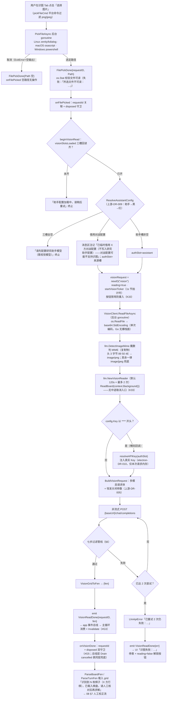
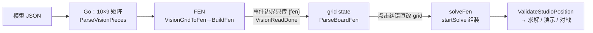
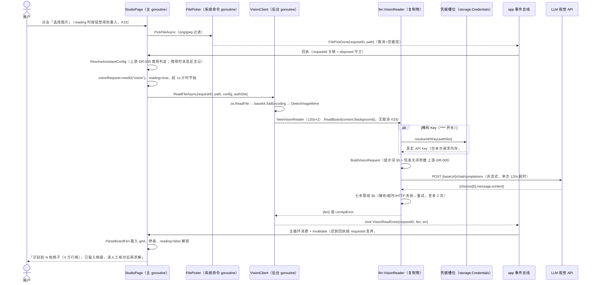

# 05a 视觉识图算法与流程（Gio 版）

> **事实源与归属声明**：识图协议与算法的逐字事实源 = 上游 `05-大模型集成设计.md` §7 +
> 复制物 `internal/llm/vision.go`（DR-G001 零修改，与上游同名文件 diff 仅 1 行 import
> 前缀）；本仓补充的是 **Gio 调用链与事件流**（00 §3/§4 线程模型与事件清单）与交互落位
> （08 §7 识图 Tab）。相关决策：上游-DR-005（思维链恒发关闭）、上游-DR-009（研究助手
> 配置运行时借用）、electron-DR-010（掩码 Key 注入闭环）。M6' 已实现并验收（T6'.3）。

## 1. 总览

- **识别目标**：用户给出一张中国象棋棋盘图片，识别出全部棋子与轮走方，组装为 FEN 载入
  残局工作室棋盘，随后**必须**经人工校正流（08 §7）复核方可进入求解。
- **实现分层**：
  - 协议层（复制物）：`internal/llm/vision.go`（475 行）——提示词常量、请求构造、响应
    七步过滤管线、重试闭环，全部语义与上游逐字一致；
  - 状态层（DR-G002 翻译物）：`internal/state/assistantconfig.go`——研究助手配置解析
    与借用判定（上游 frontend/src/features/studio/assistantConfig.ts 的 Go 翻译）；
  - UI 层（Gio 自绘）：`internal/ui/filedialog.go`（系统文件对话框）、
    `internal/ui/visionclient.go`（识图后台 goroutine）、`internal/ui/studio.go`
    （识图 Tab 状态与人工校正流）。
- **关键参数**（`internal/llm/vision.go`）：非流式多模态 POST `{baseUrl}/chat/completions`；
  temperature 0.1（:38）、max_tokens 4096（:39）、单次超时 `VisionTimeoutMs = 120_000`（:31）、
  最大尝试 `VisionMaxAttempts = 2`（:34）；**恒发关闭参数**（上游-DR-005，§5）；**无用户
  取消入口**（K33：`context.Background()`，靠 120s×2 超时 + 识别中按钮禁用 + 迟到回执
  requestId/disposed 双守卫兜底，§6 边界）。

## 2. 配置来源与凭据注入（上游-DR-009 + electron-DR-010）

识图只读**研究助手槽**，不读对战配置落盘值；助手槽未配置时运行时借用，纯内存不回写。

- **解析与优先级**：`state.ResolveAssistantConfig(assistant, black, red)`
  （`internal/state/assistantconfig.go:47-58`）——助手槽非空（`IsEmptyLlmConfig` 三字段
  全空判定，preset 不参与）→ 原样使用（AuthSlot=`assistant`）；否则借**黑方**（非空）→
  借**红方**（非空）；三槽全空返回零值。返回 `ResolvedAssistantConfig{Config, AuthSlot,
  Source}`（:33-41），**AuthSlot 随来源槽**，仅存在于本次请求内存、**永不写入助手槽**。
- **借用注记文案**（`internal/ui/studio.go:712`，逐字）：
  「研究助手未配置，已临时借用%s对战配置（不写入研究助手配置）——对战配置可能不支持识图」
  （%s = 黑方/红方，`AssistantSourceLabel` :61-70）；三槽全空终止文案（:706，逐字）：
  「请先配置研究助手模型（需视觉模型）」；三槽尚未回读齐（:658/:701，逐字）：
  「助手配置加载中，请稍后重试」。求解辅助同源借用 toast（:370）：「研究助手未配置，
  已临时借用%s对战配置」。
- **掩码 Key 注入闭环**（electron-DR-010）：UI/配置面只见掩码 Key（`****`+末4位，#G7）；
  `(*VisionReader).ReadBoard`（`vision.go:375-384`）判定 Key 以 `"****"` 前缀开头时经
  `resolveAPIKey(authSlot)` 从凭据槽位取真实 Key（实现 `internal/app/llmrepo.go:97`，
  经 `storage.Credentials`），真实 Key 仅存在于本次请求内存；掩码字符串回写不覆盖真实
  Key（防错 #8）。

## 3. 端到端流程图（选图 → FEN）

实现事实源：`internal/ui/filedialog.go`、`internal/ui/studio.go`、
`internal/ui/visionclient.go`、`internal/llm/vision.go`。**无压缩/裁剪/缩放**——原图
字节直接 base64 编码上传，请求体随图片大小线性增长。



识别期间 UI（`studio.go:1134-1151`）：按钮变灰禁用并显示「识别中… 已用时 %d 秒」
（1s 节拍 `TimerTick`，goroutine 只 emit 不直写 UI——铁律 #G3；迟到 tick 由 `reading`
标志守卫）；固定说明文案（逐字）：「一般 5~20 秒；大图或思考型模型会更久，单次超时
120 秒 × 最多 2 次（识别中不可取消）。」另有 D-006 路径兜底入口：页面内路径编辑框
「从路径载入并识别」（`loadVisionFromPath`，:670-683，跳过文件对话框直达识图）。

### 3.1 结果格式转换链（模型 JSON 从不直接绘制）

模型 JSON 在到达渲染层前经三次归一，最终一切消费方吃 FEN 字符串——识图结果一旦转成
FEN 即与摆盘/棋谱载入等其他来源的盘面无差别，后续校正（08 §7）、`ValidateStudioPosition`
整体校验、求解均无需感知数据来自图片识别。

1. **Go 侧 JSON → 10×9 矩阵**：`ParseVisionPieces`（vision.go:200-244）把稀疏
   `{col,row,piece}` 列表展开为全量 `rules.BoardGrid`（`[][]*Piece`，10 行 × 9 列），
   FEN 字符经 `PieceFromFenChar` → `*rules.Piece{Kind, Side}`，空位 nil；坐标/双王
   校验均基于矩阵而非原始 JSON。
2. **Go 侧矩阵 → FEN**：`VisionGridToFen` → `rules.BuildFen`（vision.go:291-293）；
   事件边界（`VisionReadDone`，`internal/ui/events.go:237-243`）只传 `{requestID, fen,
   err}`——模型 JSON 形状在此完全丢弃。
3. **FEN → grid state**：`onVisionDone`（studio.go:769-772）`rules.ParseBoardFen`/
   `ParseTurnFen` → `p.grid`/`p.redTurn`——识图只是给工作室共用 grid 赋初值，人工纠错
   点击（摆盘调色板，`tapBoard` :238 命中换算 08 §3.1）直接改这套矩阵。
4. **grid → 求解**：三入口（:1182-1190，「去摆盘校正」→摆盘 Tab /「重新识别」→重提
   交 /「直接采用（去求解）」→求解 Tab）后 `startSolve` 由当前 grid 组装 `solveFen`
   （:333-345），过 `ValidateStudioPosition` 整体校验（`internal/state/studio.go:
   123-182`，FEN 导入与识图载入的棋盘同过此门）。



## 4. 数据交互时序图



> 边界：识图通道**无用户主动取消**（K33，沿 Electron 版口径）——`context.Background()`
> 不可取消，识图回执也不调用总线 Cancel；防线 = 120s×2 超时兜底 + 识别中按钮禁用防
> 重入 + 迟到回执 requestId/disposed 双重丢弃（页面守卫 studio.go:752-755 与
> `Dispose()` :893-899，总线层 `Drain` cancelled 表同层兜底）。`VisionReadDone` 事件
> 注释（events.go:237-243）即此口径。

## 5. 提示词模板与请求/响应格式

**System 提示词**（`VisionSystemPrompt`，vision.go:48，逐字）：

```text
你是中国象棋棋盘识别器，只输出约定的 JSON，不输出任何其他文字。
```

**User 文本提示词**（`visionPromptText`，vision.go:51-57 逐字拼接，`\n` 为换行）：

```text
识别图中中国象棋棋盘上的所有棋子。以 JSON 回复，不要输出任何其他文字：
{"turn":"red或black","pieces":[{"col":"a-i","row":"0-9","piece":"棋子FEN字符"}]}
约定：行 0 为棋盘顶部（黑方底线），行 9 为底部（红方底线）；列 a 在左、i 在右。棋子 FEN 字符：红方大写 K(帅) A(仕) B(相) N(马) R(车) C(炮) P(兵)，黑方小写 k(将) a(士) b(象) n(马) r(车) c(炮) p(卒)。只列实际出现的棋子。
```

**请求体**（OpenAI 兼容 `/chat/completions`，非流式、无 `stream` 字段；DashScope 视觉
预设示例）：

```json
{
  "model": "qwen-vl-max",
  "messages": [
    { "role": "system", "content": "你是中国象棋棋盘识别器，只输出约定的 JSON，不输出任何其他文字。" },
    { "role": "user", "content": [
      { "type": "image_url", "image_url": { "url": "data:image/png;base64,<图片Base64>" } },
      { "type": "text", "text": "<上述 User 提示词全文>" }
    ]}
  ],
  "temperature": 0.1,
  "max_tokens": 4096,
  "enable_thinking": false
}
```

- **恒发关闭参数（上游-DR-005，无开关）**：`BuildVisionRequest`（vision.go:117-124）与
  `BuildChatRequest`（`internal/llm/config.go:190-193`）**同源同映射**——
  `ThinkingStyleFor(config.Preset)`（config.go:89-100，先查 `LlmPresets` 再查
  `VisionLlmPresets` :75-85）为 GLM 形态 → 末字段 `"thinking": {"type":"disabled"}`；
  DashScope 与其余端点兜底 → `"enable_thinking": false`。构造函数无条件注入，Gio 版
  不存在任何开启路径（铁律 #G6，配置 UI 无开关）。
- **视觉预设**（VisionLlmPresets）：通义千问 VL（阿里云百炼，qwen-vl-max，dashscope
  形态）、智谱 GLM-4.5V（视觉，glm 形态）、GPT-4o mini / OpenRouter（default 兜底）。
- 鉴权：`Authorization: Bearer <key>`；空 Key 不带鉴权头（兼容本地网关）；URL 归一
  （去尾斜杠/补路径）。图片以 `data:<mime>;base64,<数据>` dataURL 承载
  （vision.go:386 拼接）。

**模型响应约定**（`choices[0].message.content` 应为如下 JSON，`pieces` 为稀疏数组、
只列实际出现的棋子）：

```json
{ "turn": "red", "pieces": [ { "col": "a", "row": "0", "piece": "r" } ] }
```

## 6. 返回数据过滤处理管线与重试闭环

| 步 | 处理 | 代码位置（本仓 vision.go） | 失败分支（消息逐字） |
|---|---|---|---|
| 1 | HTTP 响应提取：`choices[0].message.content` | `requestOnce` :435-475 | 非 200 → `HTTP %d: <响应体前 160 字符>`（`ExcerptVisionBody` :296-302）；非 JSON → `响应不是合法 JSON`；`choices` 空 → `响应缺少 choices`；content 非字符串 → `响应缺少正文`；网络/超时 → `连接失败：%s`（:441/452/461）/ `请求超时（120s）。大模型思维链过慢或网络较差，可重试或更换更快的视觉模型`（`VisionTimeoutError` :338-341） |
| 2 | 剥 markdown 围栏 + JSON 提取：去 ```` ``` ```` 围栏 → 取首个 `{` 到末个 `}` → JSON 解析 | `ExtractVisionJSON` :149-168 | `回复中未找到 JSON` / `JSON 解析失败：<原因>` / `回复中的 JSON 不是对象`（null/数组/标量） |
| 3 | turn 解析：小写比较 `!== "black"` → 红方 | `ParseVisionTurn` :171-181 | 字段缺失 / 非 black / JSON 坏损 → **默认红方**（不报错） |
| 4 | pieces 逐条校验：非对象条目**跳过**；`col` 取首字符 a-i（`visionColIndex` :185-196）；`row` 须十进制数字（`isDigits`/`parseIntDecimal` :247/:260）；`piece` 单字符经 `PieceFromFenChar`；写入 10×9 矩阵 | `ParseVisionPieces` :200-244 | pieces 非数组 → `JSON 缺少 pieces 数组`；任一字段非法 → `非法棋子条目: <该条目原始 JSON>`；row>9 / col>8 → `坐标越界: col=<v> row=<n>` |
| 5 | 双王硬校验：红/黑 King 各恰 1 | `ValidateVisionKings` :269-287 | `双方王数量异常（红 X / 黑 Y）` |
| 6 | FEN 组装：`BuildFen(grid, isRedTurn)` | `VisionGridToFen` :291-293 | —（轮走方来自模型识别，可在校正界面修改） |
| 7 | 重试闭环：步 1-5 任一失败均触发，**至多尝试 2 次**（单次 120s） | `ReadBoard` :374-416 | 耗尽 → `LlmApiError`：`已重试 2 次仍失败：<最后错误>`（:413-415，`lastOrUnknown` :418-423） |

UI 层错误呈现（studio.go:760/:765，逐字前缀）：「识图失败：」+ 底层错误全文；FEN 回解
失败同样加此前缀。

**边界与已知限制（Gio 版）**：

- 无压缩/裁剪/缩放，原图 base64 直传（请求体随图片大小线性增长）；
- MIME 判定仅识别 PNG 魔数，其余一律按 JPEG 兜底（文件对话框已按平台过滤 png/jpeg，
  见 §3）；图片来源为**文件选择/路径直载**，识图 Tab 无粘贴载入路径
  （`VisionClient.ReadDataAsync` :49-51 为字节直载入口，M6' 未接 UI，供测试/未来来源）；
- **无用户取消**（K33）：`context.Background()` + 120s×2 超时 + 按钮禁用 +
  requestId/disposed 双守卫兜底（§4 边界注）；
- 对话（非视觉）模型识图必败：Go 版**无**上游 `annotateModelHint` 对应物，改由
  `VisionTimeoutError` 文案（「可重试或更换更快的视觉模型」）与 UI「识图失败：…」提示
  承担引导；借用对战配置时的风险注记（§2）为前置告知；
- 识别结果**必须**经 08 §7 人工校正流复核后方可进入求解流程——本地规则内核仍是合法性
  唯一事实源（铁律 #G10）。

## 7. 与上游 §7 的口径差异对照（Gio 版特有）

| 项 | 上游（Wails v2，05 §7） | 本仓（Gio） |
|---|---|---|
| 图片来源 | 前端 `File.arrayBuffer()`（浏览器文件选择） | `filedialog.go` 系统对话框选**路径** → goroutine `os.ReadFile`；另有页面内路径直载兜底（D-006） |
| base64 编码 | 前端 JS 0x8000 分块编码（防爆栈） | Go `base64.StdEncoding` 单次编码（无爆栈面） |
| MIME 判定位置 | 前端 `detectImageMime`（vision.ts） | 复制物 `DetectImageMime`（visionclient goroutine 内调用，逻辑逐字同源） |
| 调用边界 | `App.VisionReadBoard` 绑定方法 + wailsAdapter 透传 | **无绑定层**：`VisionClient` goroutine 经 app 事件总线 emit `VisionReadDone`（00 §4） |
| requestId | 识图通道无 requestId | 事件面有 requestID（`newID("vision")`），**仅用于迟到回执丢弃**（#G5），非取消凭据（K33 不变） |
| 计时呈现 | 前端秒表组件 | `startVisionTicker` goroutine 每秒 emit `TimerTick`（#G3），主循环 `visionElapsed++` |
| 借用判定 | 前端 `assistantConfig.ts`（纯 TS） | `internal/state/assistantconfig.go` `ResolveAssistantConfig`（DR-G002 翻译物，行为锚点对齐） |
| 对话模型识图提示 | `annotateModelHint` 注记 | 无对应物；超时文案 + UI 失败提示承担（§6 边界） |
| 校正流载体 | React grid state（EndgameStudioPage） | `StudioPage.grid`（Gio 保留态封装，DR-G003；三入口见 08 §7） |

协议面（提示词逐字、请求体、关闭参数映射、七步管线、120s×2、无压缩直传）与上游
**零差异**——差异全部集中在调用链与事件承载层，符合"领域复制物零修改 + 架构层重写"
的归属划分（README 事实源声明）。
