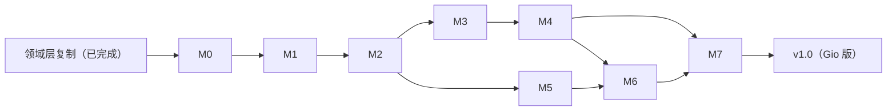

# 10 实施路线图（Gio 版）

> 里程碑编号 M0'~M7' 与上游 M0~M7 一一对应；领域层已随复制 commit 就位，故 M1'~M6' 的重心是 **UI+状态层对接**（对接锚点=00 §4 调用与事件清单）。**M0' 先行排险**：UI POC 五项结论回填 08 文档与 DR-G003，排险不过则先修路线再开工。

## 1. 里程碑

| 里程碑 | 内容 | 验证门 | 依赖 |
|---|---|---|---|
| **M0' 工程骨架 + UI POC** | go.mod 接线（gioui.org + go-text/typesetting，锁版）+ internal/{app,ui,state} 目录骨架 + main.go 薄入口 + **POC 排险五项**：①棋盘自绘（00 §3.2 全要素）②220ms 动画帧循环（08 §4）③中文 IME+字体（08 §10）④长列表虚拟化（合成 14 万局数据集，08 §8）⑤WSLg 渲染（X11/Wayland/软渲染兜底）+ ci.yml 骨架（三平台 gofmt/vet/test -race） | POC 窗口 WSLg 实弹；五项各有可运行 demo，**结论回填 08 §12 与 DR-G003**；CI 三平台全绿 | 复制 commit |
| **M1' 状态层核心 + 主页** | internal/state 骨架 + gameVm 翻译（fenHistory 四收口、agreeDraw/resign、DR-008 起始 FEN 语义）+ globalSettings + 主页 7 入口导航 + 裁决触发收口点（07 §3） | gameVmFenHistory/autoSaveRestore/gameStore 翻译用例全绿；主页可导航 | M0' |
| **M2' 双人对战 + 存储** | internal/storage 对接（DAO/设置/凭据路径装配）+ 自动保存/恢复状态机（Gio 生命周期事件源）+ 双人对弈页全量（棋盘/动画/侧板/操作/弹窗）+ **UI 裁决接线（双人页）** | 双人完整对局；存档恢复/死局清理；fenHistory 测试；悔棋回滚裁决状态；防错 #1~#7 手测 | M1' |
| **M3' 引擎对接 + 人机页** | engine Runner 直调（FindBestMoveEx/HistoryFens 传入）+ 人机对战页（执黑可选/难度/引擎类型/思考中取消）+ **UI 裁决接线（人机页）** | 对拍回归全绿（复制物基线不动）；cancel/迟到丢弃用例；难度 5 应答性能门 | M2' |
| **M4' LLM 全链路对接** | llm 包直调（流式事件总线/取消）+ 人机 LLM 页 + LLM vs LLM 页（配置卡/流式消息区/否决链/粘性保存按钮）+ **UI 裁决接线（LLM 两页）** | mock SSE 回归全绿；事件总线 requestId 用例；真实端点手测一整局（思维链关闭生效） | M3' |
| **M5' 语料 + 棋谱对接** | parsers+storage 语料对接（扫描/下载/懒解析分批 128/generation）+ 语料库页 + 棋谱库页（长列表虚拟化实测）+ 重放器 + 导出/进入对战 + 文件对话框决策项定案（00 §4） | 语料下载/解析手测；14 万局长列表滚动性能；PGN 导出快照 | M2'（棋谱）/复制物（解析） |
| **M6' 工作室 + 求解器 + 识图对接** | solver Runner 直调 + 工作室三 Tab（摆盘/求解悬浮进度/识图校正流）+ LLM 求解辅助 + 演示播放器 | 6 验证 FEN；识图人工校正流手测；联动对战 | M4'/M5' |
| **M7' 评估 + 打包发布** | cmd/eval 回归（4 profile）+ 三平台打包（**单二进制**为基线 + Linux AppImage/deb/tar.gz + macOS dmg；Windows 形态定案）+ release.yml 适配（上游 5 轮踩坑点逐条吸收）+ DoD 验收 | 四 profile 报告可产出；三平台安装产物启动冒烟 | 全部 |

每验证门 = 09 质量门全绿 + 里程碑专属验收用例 + **用户手动验收（11 §5）**。

## 2. 分支与提交策略

沿上游 10 §2：main 保护、`feature/mN-*` 模式、合入打 tag（`v0.x.0-mN'`，M7' 为 `v1.0.0`）；DR 随实现同 commit（`Decision: DR-Gxxx`）；文档先行（AGENTS.md 同步纪律）。

## 3. 风险表

| # | 风险 | 影响 | 缓解 |
|---|---|---|---|
| R-G1 | WSLg 下 Gio 渲染异常（GPU/合成/输入） | M0' | POC-5 排险五项先行；软渲染兜底（llvmpipe）；**无浏览器模式可退**（上游 R7' 兜底不存在），排险失败即调整技术路线（走 DR） |
| R-G2 | 中文 IME 在个别平台缺陷 | M0'/M4'/M5' | POC-3 实测；缺陷登记 KNOWN_ISSUES + workaround（粘贴兜底） |
| R-G3 | 长列表/全帧重绘性能不达标 | M0'/M5' | POC-1/POC-4 合成数据实测；离屏缓存棋盘静态层备选（08 §3.2） |
| R-G4 | 220ms 帧动画掉帧（低帧率设备） | M0' | 帧时间戳权威（不依赖帧数）；掉帧只影响观感不影响正确性 |
| R-G5 | Gio v0.x API 破坏性变更 | 全程 | M0' 锁定版本入 go.mod；升级走 DR 流程 + 全量回归 |
| R-G6 | 状态层翻译走样（249→173 条锚点覆盖不全） | M1'/M2' | 09 §3 翻译纪律（用例名对应、禁删减断言）；PROGRESS 逐文件勾选 |
| R1 | Linux 打包依赖（AppImage 工具） | M7' | 上游 R1' 经验+5 轮 release.yml 迭代踩坑点逐条吸收（10 §4） |
| R2 | 领域行为漂移 | — | **已消除**：领域层为上游映照复制物（DR-G001），对拍基线继承 |
| R3 | Key/凭据泄漏 | M4' | 复制物包边界收口 + 掩码铁律不变 |

## 4. 打包工具候选（M7' 裁决定案，先预置）

| 平台 | 基线方案 | 候选/备注 |
|---|---|---|
| 全平台 | `go build` 单二进制（ldflags 注入版本）——**Gio 核心优势，上游 K35 的根治** | macOS 需 cgo（Metal）；Linux X11/Wayland 依赖以 POC-5 结论为准 |
| Linux | nfpm deb + linuxdeploy AppImage + tar.gz 兜底（上游-DR-010 同构复用） | nfpm.yaml 不写 depends 硬绑（上游同口径）；AppImage 体积预期大幅低于上游 80MB |
| Windows | **候选 A：裸 exe + 使用说明**；候选 B：NSIS 安装包（choco + GITHUB_PATH 踩坑点照上游） | M7' 定案；Gio Windows 后端无 WebView2 依赖 |
| macOS | .app bundle 手工组装 + hdiutil dmg（UDZO） | .app 结构（Info.plist/图标）M7' 按 Gio 官方指引实现；路径 glob 不写死（上游第 2 轮教训） |
| CI 缓存 | go-build + 模块缓存 | release job **必须 checkout** + `gh release create --repo` + draft 自校验（上游第 4 轮教训逐条吸收）；全平台 -race（上游-DR-012） |

> 上游 5 轮 CI 迭代踩坑点吸收清单：① Windows NSIS 前置 choco install + 显式写 GITHUB_PATH；② macOS .app 取 wails.json name 的 glob 兜底 →（Gio 版）.app 路径 glob 同理；③ release job 补 checkout 防 untagged-<hash> 幽灵 draft；④ draft 创建后自校验资产名单；⑤ go test 全平台 -race。工具全部不进 go.mod（依赖白名单哲学，上游-DR-010 同）。

## 5. 验收基线（DoD for v1.0 Gio 版，对齐上游四条）

1. 上游 01 文档 E-F01~F42 全部功能可用（含两处既定差异：重复裁决前置、思维链强制关闭）——UI 由 Gio 自绘实现（08 规格）；
2. 09 质量门全绿（gofmt/vet/`go test ./... -race`/mock SSE）+ 三平台安装产物；
3. 真实 LLM 端点手测：人机 LLM 一整局 + LLM vs LLM 一整局 + 求解辅助一次 + 识图一次（全程思维链关闭生效）；
4. MatchRunner 四 profile 报告可复现（与上游 v1.0 同数量级结论；复制物同源，预期逐位一致 randomness=0 路径）。
